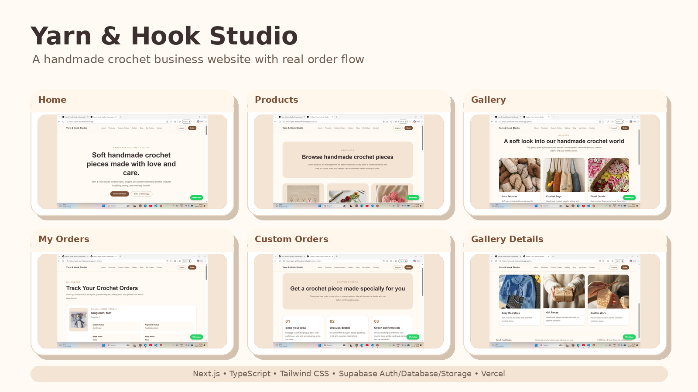

# Yarn & Hook Studio

Yarn & Hook Studio is a handmade crochet business website built for showcasing crochet products, receiving customer order requests, managing product availability, and tracking crochet order payments.

This project was created as a practical business website for a crochet brand. It includes both customer-side features and admin-side features, making it useful for real-world handmade product order management.



## Live Website

https://yarn-and-hook.vercel.app/

## Project Overview

Yarn & Hook Studio allows customers to browse handmade crochet products, place order requests, and track their order status.

Since crochet products are handmade and depend on yarn availability, custom color choices, making time, and order queue, the website does not collect payment immediately. Instead, the customer sends an order request first. The admin checks the order, confirms the final price, requests payment, and then verifies the payment reference.

This makes the order flow more realistic for a handmade crochet business.

## Features

### Customer Features

- View crochet products with images, price, category, and description.
- Sign up and login using Supabase authentication.
- Place crochet product order requests.
- Add customer details such as name, phone number, Instagram ID, quantity, address, delivery method, and payment preference.
- View all placed orders from the My Orders page.
- Track order status and payment status.
- View final price, advance amount, estimated making time, and admin notes.
- Submit payment reference or UPI transaction ID only after admin requests payment.
- Contact the business through WhatsApp or Instagram.

### Admin Features

- Admin dashboard.
- Add new crochet products.
- Upload product images using Supabase Storage.
- Show or hide products from the public products page.
- Delete products.
- View all customer orders.
- View customer address, phone number, Instagram ID, quantity, notes, delivery method, and payment preference.
- Update order status.
- Update payment status.
- Add final price, advance amount, estimated making time, payment reference, and admin note.
- Verify customer payment reference after submission.

## Crochet Order Flow

The order flow is designed specially for handmade crochet products.

1. Customer views products.
2. Customer submits an order request.
3. Order status starts as `pending`.
4. Payment status starts as `not_requested`.
5. Admin checks yarn availability, design possibility, delivery location, order queue, and final price.
6. Admin confirms the order.
7. Admin updates final price, advance amount, estimated time, and admin note.
8. Admin changes payment status to `payment_requested`.
9. Customer submits payment reference or UPI transaction ID.
10. Payment status becomes `paid_submitted`.
11. Admin verifies the payment.
12. Payment status becomes `verified`.
13. Order moves to `making`.
14. Order is completed or cancelled based on the situation.

## Order Status Options

```txt
pending
confirmed
making
completed
cancelled
```

## Payment Status Options

```txt
not_requested
payment_requested
paid_submitted
verified
cancelled
```

## Tech Stack

- Next.js
- TypeScript
- Tailwind CSS
- Supabase Authentication
- Supabase Database
- Supabase Storage
- Vercel
- Git
- GitHub

## Main Pages

- Home page
- About page
- Products page
- Product order page
- My Orders page
- Custom Orders page
- Gallery page
- Blog page
- Blog detail page
- Contact page
- Admin dashboard
- Admin products page
- Admin orders page

## Screenshots

The project includes a preview collage showing the major pages and features of the website.


## Database Tables

The project uses Supabase for backend functionality.

Main tables:

```txt
profiles
products
orders
```

### profiles

Stores user profile details and role information.

Main fields:

```txt
id
full_name
role
created_at
```

Roles:

```txt
customer
admin
```

### products

Stores crochet product details.

Main fields:

```txt
id
name
description
price
category
image_url
is_available
created_at
```

### orders

Stores customer order requests and payment tracking details.

Main fields:

```txt
id
user_id
product_id
customer_name
phone
instagram_handle
quantity
notes
status
address_line
city
district
pincode
landmark
delivery_method
payment_method
payment_status
final_price
advance_amount
payment_reference
admin_note
estimated_time
created_at
```

## Supabase Storage

The project uses Supabase Storage for product images.

Storage bucket:

```txt
product-images
```

Admin users can upload product images, and public users can view product images.

## Environment Variables

Create a `.env.local` file in the project root.

```env
NEXT_PUBLIC_SUPABASE_URL=your_supabase_project_url
NEXT_PUBLIC_SUPABASE_PUBLISHABLE_KEY=your_supabase_publishable_key
```

Do not share private keys or service role keys publicly.

## Project Setup

Install dependencies:

```bash
npm install
```

Run the development server:

```bash
npm run dev
```

Open the local project:

```txt
http://localhost:3000
```

Build the project:

```bash
npm run build
```

## Deployment

The project is deployed using Vercel.

Live site:

```txt
https://yarn-and-hook.vercel.app/
```

## What I Learned

Through this project, I learned how to:

- Build a business website using Next.js.
- Use TypeScript in a real project.
- Style pages using Tailwind CSS.
- Create reusable components.
- Use Supabase authentication.
- Create and manage database tables in Supabase.
- Use Supabase Row Level Security policies.
- Upload and display images using Supabase Storage.
- Build an admin dashboard.
- Manage customer orders.
- Create a realistic handmade product order flow.
- Deploy a full-stack project using Vercel.
- Use Git and GitHub for version control.

## Future Improvements

This project can be improved further by adding more real-world business features such as:

- Product search and category filters for bags, accessories, wearables, gifts, and custom items.
- Product detail pages with more photos, color options, size details, and care instructions.
- Admin product editing option to update product name, price, image, stock, and availability.
- Order limit or queue system so the admin can control how many crochet orders are accepted at a time.
- Better custom order form where customers can upload reference images and choose colors or yarn type.
- Delivery charge calculation based on location, pincode, or pickup/delivery method.
- WhatsApp notification or email notification when order status or payment status changes.
- Online payment gateway integration after the admin confirms the order and final price.
- Customer profile page with saved address and contact details.
- Review or testimonial section for customers to share feedback.
- Better image optimization and product photography for a more professional look.
- Dashboard analytics for admin, such as total orders, pending orders, completed orders, and revenue.
- SEO improvements for better visibility on Google.
- Blog posts about crochet care tips, gift ideas, handmade products, and behind-the-scenes work.

## Project Status

Yarn & Hook Studio is currently a working crochet business website with product management, customer order requests, admin order management, payment request flow, and payment reference tracking.

The project is ready for portfolio use and can be improved further for real business use.

## Author

Built by Shabana P.